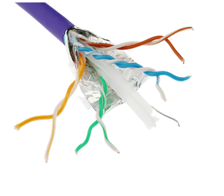
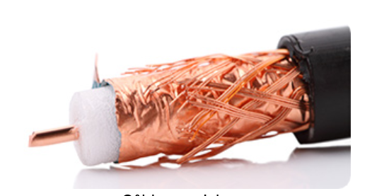

# 05 - La Couche Physique (Layer 1) 🔌

> **Rôle :** La couche physique est la seule qui touche le matériel réel. Son job est de transmettre des **bits** (0 et 1) d'un appareil à un autre via un support physique (Média).
> Elle ne s'occupe pas de la signification des données, juste de leur transport brut sous forme de signaux (électriques, lumineux ou ondes radio).

---

## 1. Les Caractéristiques Fondamentales

Pour qu'un bit voyage, il faut définir des règles physiques strictes.

### 📏 Les Normes
Contrairement aux couches logicielles (gérées par l'IETF), la couche physique est régie par des ingénieurs en électronique :
* **ISO, TIA/EIA :** Pour le câblage (ex: TIA-568).
* **IEEE :** Pour l'architecture (ex: 802.3 Ethernet, 802.11 Wi-Fi).

### ⚡ Signalisation et Encodage
Comment distinguer un `0` d'un `1` sur un fil ?
* **Encodage :** C'est la méthode pour convertir les données en modèle.
    * *Exemple (Manchester) :* Une transition du haut vers le bas représente un 0.
* **Signalisation :** C'est la méthode physique pour générer le signal.
    * *Cuivre :* Variation de **voltage** (ex: +5V = 1, 0V = 0).
    * *Fibre :* Impulsion **lumineuse**.
    * *Sans-fil :* Variation d'**ondes radio**.

### 📊 Bande Passante vs Débit
Ne confondez pas ces termes !
* **Bande passante (Bandwidth) :** La capacité *théorique* maximale du média.
* **Débit (Throughput) :** La vitesse *réelle* observée (souvent plus basse).
* **Débit applicatif (Goodput) :** La vitesse réelle pour les données utiles (sans les en-têtes).

---

## 2. Le Câblage en Cuivre 🟠

C'est le plus répandu, le moins cher, mais il a des ennemis.

### ⚠️ Les Ennemis du Cuivre
Le signal électrique peut être perturbé par deux phénomènes majeurs :
1.  **EMI / RFI :** Interférences Électromagnétiques (Lampes néon, Moteurs, Ascenseurs).
2.  **Crosstalk (Diaphonie) :** Quand le signal d'un fil bave sur le fil d'à côté (interférence interne).

### 🛠️ Les Types de Câbles

| Type | Nom | Image | Usage |
| :--- | :--- | :---: | :--- |
| **UTP** | Unshielded Twisted Pair |  | **Standard LAN**. Pas de blindage, juste des torsades pour annuler la diaphonie. |
| **STP** | Shielded Twisted Pair |  | **Milieux industriels**. Chaque paire est entourée d'alu pour protéger des EMI. |
| **Coaxial** | Coax |  | **Internet Câble / TV**. Un conducteur central épais. (Moins utilisé en LAN). |

### 🔌 La Connectique UTP (RJ45)
C'est le standard Ethernet. Il suit la norme **TIA-568**.
* **Droit (Straight-Through) :** `A ↔ A` ou `B ↔ B`. Pour relier des équipements différents (PC ↔ Switch).
* **Croisé (Crossover) :** `A ↔ B`. Pour relier des équipements identiques (PC ↔ PC, Switch ↔ Switch).
    * *Rappel :* La plupart des appareils modernes font ça automatiquement (**Auto-MDIX**).

---

## 3. Le Câblage en Fibre Optique 💡

Ici, on transmet de la lumière. C'est le top de la performance.

### ✨ Propriétés
* **Immunité totale** aux interférences (EMI/RFI).
* **Atténuation très faible :** Peut parcourir des kilomètres sans perte.
* **Sécurité :** Difficile à pirater (on ne peut pas écouter le signal sans couper le câble).

### 🧵 Multimode vs Monomode (Le classique des exams !)

| Caractéristique | Fibre Multimode (MMF) | Fibre Monomode (SMF) |
| :--- | :--- | :--- |
| **Cœur** | Large (62.5 microns). Laisse passer plusieurs rayons lumineux. | Très fin (9 microns). Un seul chemin de lumière. |
| **Source** | LED (Moins cher). | Laser (Plus cher). |
| **Distance** | Courte (< 500m). Idéal pour les LAN/Campus. | Longue (Des km). Idéal pour les WAN/Opérateurs. |
| **Couleur Gaine** | Souvent 🟠 Orange ou 🔵 Aqua. | Souvent 🟡 Jaune. |

### 🔗 Connecteurs Fibre
Contrairement au RJ45 unique, il y a plein de formats :
* **ST :** Rond, à baïonnette (Vieux).
* **SC :** Carré (Standard).
* **LC :** Petit carré (Lucent Connector). Très utilisé car il prend peu de place (Haute densité).

---

## 4. Les Supports Sans-Fil (Wireless) 📡

Le média, c'est l'air. Les signaux sont des ondes radio.

### 📶 Caractéristiques
* **Pratique :** Mobilité totale.
* **Risqué :** Le média est partagé (tout le monde peut écouter ou brouiller).
* **Half-Duplex :** On ne peut pas émettre et recevoir en même temps (comme un Talkie-Walkie).

### Les Standards Wi-Fi (IEEE 802.11)
* **802.11ac (Wi-Fi 5) :** Standard actuel répandu.
* **802.11ax (Wi-Fi 6) :** Haute performance, meilleure gestion de la densité.

---

## ⚔️ Bilan : Cuivre vs Fibre

| Critère | Cuivre (UTP) | Fibre Optique |
| :--- | :--- | :--- |
| **Coût** | 💰 Faible | 💰💰💰 Élevé (Câble + Équipements) |
| **Distance** | Max 100 mètres | De 500m à 100km |
| **Immunité EMI** | ❌ Faible (Sensible aux parasites) | ✅ Totale (C'est de la lumière) |
| **Installation** | Facile | Délicate (Fragile, soudures précises) |
| **Usage** | Raccordement final (PC, Tel) | Cœur de réseau, Inter-bâtiments |
