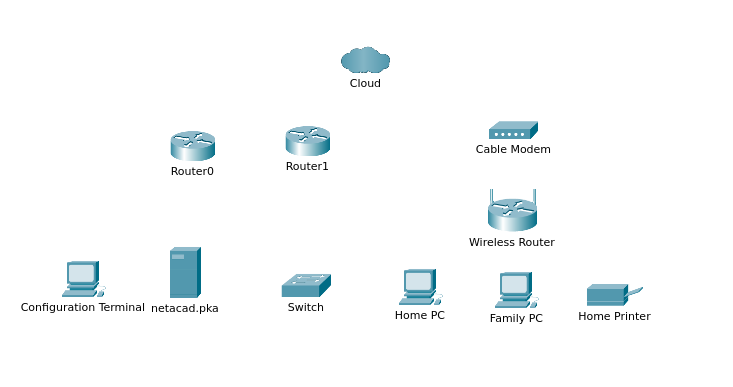
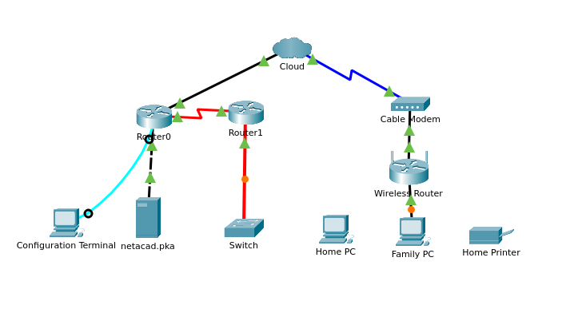

# 🔌 Lab 02 : Connexion Physique (Wired & Wireless)

> **Objectif :** Sélectionner le média de transmission approprié (Câble) pour interconnecter différents types de périphériques (Routeurs, Switchs, PC, Cloud, Modem).

## 1. Contexte du Lab

Dans cet exercice Packet Tracer, la topologie logique est déjà configurée, mais la topologie physique est inexistante. L'objectif est de relier les équipements en respectant les normes de la **Couche 1 du modèle OSI**.

**Compétences validées :**
* Identification des types de câbles (Série, Coaxial, Cuivre).
* Compréhension de la distinction **Droit** (Straight-Through) vs **Croisé** (Cross-Over).
* Connexion console pour l'administration.

## 2. Topologie

| État Initial | État Final (Câblé) |
| :---: | :---: |
|  |  |

## 3. Choix des Câbles et Justification 🛠️

Le choix du câble n'est pas aléatoire. Il dépend des interfaces et de la nature des appareils connectés.

### 🅰️ Les Connexions WAN (Réseau Étendu)
Pour sortir du réseau local, nous utilisons des technologies spécifiques.

* **Routeur 0 ↔ Cloud :** Câble **Cuivre Droit**.
    * *Pourquoi ?* Le Cloud simule ici une connexion Ethernet vers un fournisseur, agissant comme un commutateur.
* **Cloud ↔ Modem Câble :** Câble **Coaxial**.
    * *Pourquoi ?* C'est la norme standard pour l'internet par le câble (DOCSIS).
* **Routeur 0 ↔ Routeur 1 :** Câble **Série (DCE/DTE)**.
    * *Pourquoi ?* Utilisé pour les liaisons point-à-point longue distance historiques entre routeurs.

### 🅱️ Les Connexions LAN (Réseau Local)
C'est ici que l'on voit la diversité des médias (Cuivre vs Fibre).

* **Routeur 1 ↔ Switch :** Câble **Fibre Optique** (Ligne Orange).
    * *Pourquoi ?* Le lab utilise ici des interfaces fibre (probablement des ports `FastEthernet 100BASE-FX`). Contrairement au cuivre, la fibre utilise la lumière, ce qui la rend insensible aux interférences électriques et permet de plus longues distances.
    * *Note :* En vue physique, on verrait deux brins (un pour l'émission TX, un pour la réception RX).
* **Switch ↔ PC :** Câble **Cuivre Droit** (Ligne Noire).
    * *Pourquoi ?* C'est la connexion standard Ethernet (RJ45) pour les terminaux.
* **Routeur 0 ↔ Serveur (Netacad.pka) :** Câble **Cuivre CROISÉ** (Ligne Noire pointillée).
    * *Pourquoi ?* **C'est le point clé du TP.** Un PC et un Routeur utilisent les mêmes broches pour émettre (1 & 2) et recevoir (3 & 6). Si on utilise un câble droit, ils émettent sur le même fil et se percutent. Le câble croisé inverse les fils.

> **Note :** Les cartes réseaux modernes ont la fonction *Auto-MDIX* qui croise automatiquement, mais ce Lab force à connaître la théorie historique.

> **Rappel des couleurs Packet Tracer :**
> * 🟠 **Orange :** Fibre Optique.
> * ⚡ **Rouge (Éclair) :** Câble Série (WAN).
> * ⚫ **Noir (Continu) :** Cuivre Droit.
> * ⚫ **Noir (Pointillé) :** Cuivre Croisé.

### ©️ La Connexion de Gestion
* **PC de Config ↔ Routeur (Console) :** Câble **Console** (Bleu ciel).
    * *Pourquoi ?* Ce n'est pas une connexion réseau. C'est une connexion série directe pour configurer l'équipement en ligne de commande (CLI) via un terminal (RS-232).

## 4. Vérification ✅

Une fois le câblage effectué, les voyants sont passés au vert (Link Up). La connectivité a été validée par :
1.  **Ping :** De *PC Familial* vers *netacad.pka* (Traversée du réseau complet).
2.  **Web :** Accès HTTP au serveur web via le navigateur.
3.  **Show ip interface brief :** Vérification sur le routeur que les statuts sont "Up/Up".

---
*Lab réalisé sur Cisco Packet Tracer.*
