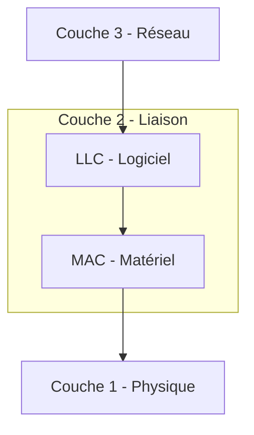

# 05 - La Couche Liaison de Données (Layer 2) 🔗

> **Rôle :** Préparer les données pour le réseau physique. Elle permet l'échange de données entre deux périphériques sur le **même** réseau (ou sur le même lien).
> Si la couche 1 est la route (le bitume), la couche 2 est le code de la route (qui a le droit de passer, comment on s'arrête, etc.).

---

## 1. Les Sous-Couches (Le modèle IEEE 802)

Pour s'adapter à tous les types de supports (Cuivre, Fibre, Wi-Fi), la couche 2 est divisée en deux sous-couches distinctes :

| Sous-couche | Nom complet | Rôle | Avec qui elle parle ? |
| :--- | :--- | :--- | :--- |
| **LLC** | Logical Link Control (802.2) | C'est le "Cerveau". Elle identifie quel protocole réseau est utilisé (IPv4 ou IPv6). | Parle à la **Couche 3 (Réseau)**. |
| **MAC** | Media Access Control (802.3 / 802.11) | C'est les "Muscles". Elle gère l'adressage physique et l'accès au câble. | Parle à la **Couche 1 (Physique)**. |

---

## 2. Topologies : Physique vs Logique 🗺️

Il ne faut pas confondre comment les câbles sont branchés et comment les données circulent.

* **Topologie Physique :** Le câblage réel (ex: Étoile, Bus, Anneau).
* **Topologie Logique :** La manière dont les données voient le réseau.
* *Exemple :* Un réseau peut être câblé en Étoile (Physique) mais fonctionner comme un Bus (Logique) si on utilise un vieux Hub.

### Topologies WAN (Réseau Étendu)

Quand on relie deux sites distants (ex: Paris et Lyon) :

1. **Point-à-Point :** Connexion directe (Le plus simple).
2. **Hub and Spoke (Étoile) :** Un site central (Hub) relié à plusieurs sites distants (Spokes).
3. **Maillée (Mesh) :** Tout le monde est relié à tout le monde (Haute disponibilité, mais cher).

---

## 3. Le Contrôle d'Accès au Support 🚦

Comment éviter que tout le monde parle en même temps sur le câble ?

### A. Duplex (La gestion du dialogue)

| Mode | Analogie | Description | Matériel |
| --- | --- | --- | --- |
| **Half-Duplex** | Talkie-Walkie | On peut émettre OU recevoir, mais **pas** en même temps. Risque de collision élevé. | Hub, Wi-Fi, Vieux Bus. |
| **Full-Duplex** | Téléphone | On peut parler et écouter **simultanément**. Pas de collisions. | Switchs modernes. |

### B. Méthodes d'accès (Quand a-t-on le droit de parler ?)

Quand le média est partagé (Half-Duplex), il faut des règles strictes.

#### 1. CSMA/CD (Collision Detection) - Pour le Filaire 🔌

*Utilisé par les vieux Hubs Ethernet (Legacy).*

* **Principe :** J'écoute. Si c'est libre, je parle.
* **Si ça tape (Collision) :** Je détecte le choc, j'envoie un signal de brouillage (Jam signal) et j'attends un temps aléatoire avant de recommencer.

#### 2. CSMA/CA (Collision Avoidance) - Pour le Sans-Fil 📡

*Utilisé par le Wi-Fi (802.11).*

* **Principe :** On ne peut pas "détecter" une collision dans l'air facilement. Donc on fait tout pour l'éviter.
* **Méthode :** Je signale mon intention de parler. J'attends que le récepteur me dise "OK, vas-y" (ACK) avant d'envoyer mes données. C'est plus poli, mais plus lent.

---

## 4. La Trame (Frame) 📦

C'est l'unité de données (PDU) de la couche 2. C'est l'enveloppe qui contient le paquet IP.

### Structure générique d'une trame

Contrairement aux autres couches, la couche 2 ajoute quelque chose **devant** (Header) et **derrière** (Trailer).

| Champ | Taille (Octets) | Rôle |
| --- | --- | --- |
| **Préambule** | 8 | "Ding Dong" ! Sert à synchroniser les horloges et prévenir que la trame arrive. |
| **Adresse Destination** | 6 | Adresse MAC du destinataire (Pour qui est-ce ?). |
| **Adresse Source** | 6 | Adresse MAC de l'expéditeur (Qui l'envoie ?). |
| **Type / Longueur** | 2 | Indique le protocole encapsulé (ex: IPv4 = 0x800). |
| **DONNÉES (Packet)** | 46 - 1500 | Le contenu utile (Le paquet IP venant de la couche 3). |
| **FCS (Trailer)** | 4 | **Frame Check Sequence**. Contient le CRC (résultat d'un calcul mathématique) pour vérifier s'il y a eu une erreur durant le transport. |

> **Note importante :** Si le calcul du FCS à l'arrivée ne correspond pas à celui envoyé, la trame est considérée comme corrompue et est **jetée** (Dropped). La couche 2 ne demande pas de renvoi (c'est le boulot de TCP en couche 4).

### L'Adresse de Couche 2 (MAC)

* Uniquement utilisée pour communiquer dans le **réseau local** (LAN).
* Dès que la trame passe un routeur, l'en-tête de couche 2 est retiré et remplacé par un nouveau pour le réseau suivant.

---
