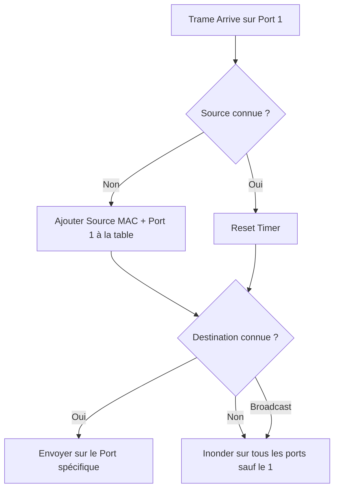
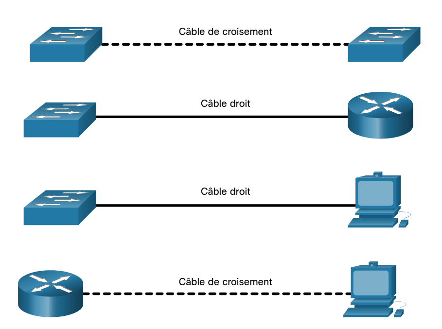

# 06 - Commutation Ethernet & Fonctionnement du Switch 🔀

> **Rôle :** Comprendre la technologie dominante des réseaux locaux (Ethernet) et comment un commutateur (Switch) prend ses décisions de transfert à la vitesse de l'éclair.

---

## 1. La Trame Ethernet (L'enveloppe) ✉️

Dans le monde Ethernet, les données de la couche 3 (Paquets IP) sont encapsulées dans une **Trame**. La taille de la trame doit être comprise entre **64 octets** (minimum) et **1518 octets** (maximum).

* **< 64 octets :** "Runt" (Fragment de collision) -> Jetée.
* **> 1518 octets :** "Giant" (Jumbo frame) -> Peut être jetée si le switch ne supporte pas.

### Structure détaillée d'une trame Ethernet 802.3

| Champ | Taille | Rôle |
| :--- | :---: | :--- |
| **Préambule** | 8 octets | Synchronisation (101010...) + **SFD** (Start Frame Delimiter) pour dire "Attention, ça commence !". |
| **Adresse Destination** | 6 octets | L'adresse MAC du destinataire (Pour qui ?). |
| **Adresse Source** | 6 octets | L'adresse MAC de l'émetteur (C'est qui ?). |
| **Type / Longueur** | 2 octets | Indique le protocole encapsulé (ex: `0x0800` pour IPv4, `0x86DD` pour IPv6, `0x0806` pour ARP). |
| **Données (Data)** | 46-1500 | Le paquet IP (Payload). Si trop court, on ajoute du bourrage (Pad). |
| **FCS (Trailer)** | 4 octets | **Frame Check Sequence**. Le contrôle d'erreur (CRC). Si le calcul est faux, la trame est poubelle. |

---

## 2. L'Adresse MAC (L'identité physique) 🆔

L'adresse MAC (Media Access Control) est unique au monde pour chaque carte réseau. Elle est codée sur **48 bits** (6 octets) et s'écrit en **Hexadécimal**.

### Format : `OUI : NIC`
* **Les 24 premiers bits (OUI) :** Identifiant du constructeur (ex: Cisco, Dell, Apple).
* **Les 24 derniers bits (NIC) :** Numéro de série unique de la carte.

### Les 3 Types d'adresses
1.  **Monodiffusion (Unicast) :** De 1 vers 1. (MAC précise d'un PC).
2.  **Diffusion (Broadcast) :** De 1 vers TOUS.
    * Adresse spéciale : **`FF:FF:FF:FF:FF:FF`**.
    * Le switch inonde (flood) cette trame sur tous les ports.
3.  **Multidiffusion (Multicast) :** De 1 vers un Groupe.
    * Commence souvent par `01:00:5E...` (pour IPv4).

---

## 3. La Logique du Switch (Table MAC) 🧠

Contrairement au Hub (qui est bête et répète tout), le Switch est intelligent. Il maintient une **Table d'adresses MAC** (CAM Table) pour savoir qui est branché où.

### L'Algorithme du Switch (À connaître par cœur !)
Le switch prend deux décisions pour chaque trame reçue :

#### Étape 1 : Apprentissage (Sur la Source) 📥
*Le switch regarde l'adresse MAC **SOURCE** de la trame.*
* **Si la MAC n'est pas dans la table :** Il l'ajoute avec le numéro du port d'entrée. *"Tiens, PC A est sur le port 1"*.
* **Si la MAC est déjà dans la table :** Il met à jour le chronomètre (aging timer, souvent 5 min).

#### Étape 2 : Transmission (Sur la Destination) outbox
*Le switch regarde l'adresse MAC **DESTINATION**.*
* **Si la MAC est connue :** Il envoie la trame **uniquement** sur le bon port (Unicast).
* **Si la MAC est inconnue :** Il envoie la trame sur **tous** les ports sauf celui d'arrivée. On appelle ça l'**Inondation** (Flooding).
* **Si c'est du Broadcast (FF:FF...) :** Inondation systématique.

---

## 4. Méthodes de Transmission (Vitesse vs Fiabilité) 🚀

Comment le switch gère la trame entre le moment où elle entre et où elle sort ?

| Méthode | Description | Avantage | Inconvénient |
| --- | --- | --- | --- |
| **Store-and-Forward** | Le switch reçoit la trame **entière**, vérifie le FCS (erreurs), puis l'envoie. | **Fiabilité max**. Aucune erreur ne passe. | Plus lent (Latence), surtout pour les grosses trames. |
| **Cut-Through** | Le switch lit juste l'adresse de destination et commence à envoyer tout de suite. | **Vitesse max**. Latence très faible. | Risque de propager des trames corrompues. |
| **Fragment-Free** | (Variante Cut-Through) Lit les 64 premiers octets (là où sont les collisions) avant d'envoyer. | Compromis Vitesse/Sécurité. | Moins utilisé aujourd'hui. |

> **Note :** La plupart des switchs modernes utilisent **Store-and-Forward** car ils sont assez puissants pour le faire très vite.

### Concepts de Ports

* **Full-Duplex :** Envoi/Réception simultanés (Switchs modernes).
* **Half-Duplex :** Un seul sens à la fois (Vieux Hubs, Wi-Fi).

* **Auto-MDIX :** Fonctionnalité qui détecte automatiquement le type de câble (Droit ou Croisé) et adapte le port. Plus besoin de se soucier du type de câble !

  

---
