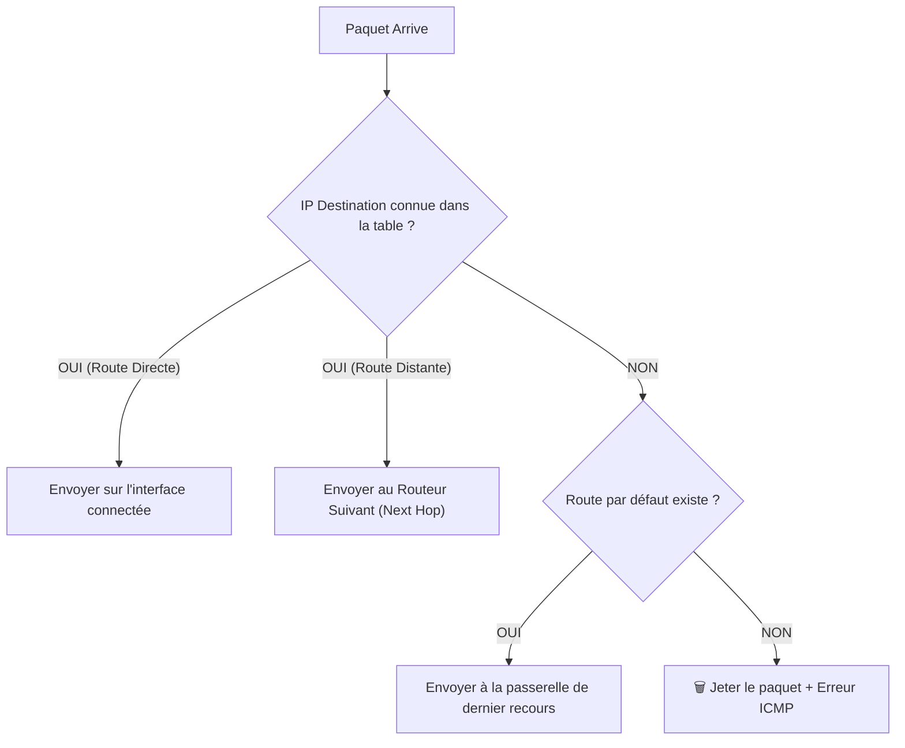

# 07 - La Couche Réseau (Layer 3) 🌐

> **Rôle :** Transporter des paquets de données d'un hôte à un autre, même s'ils sont sur des réseaux géographiquement éloignés.
> Contrairement à la couche 2 (qui reste locale), la couche 3 est **routable**. Elle traverse le monde.

---

## 1. Le Protocole IP : Ses 3 Caractéristiques Clés 🔑

Le protocole **IP** (Internet Protocol) est conçu pour être léger et rapide. Il a trois défauts (qui sont en fait des qualités pour la vitesse) :

1.  **Sans Connexion (Connectionless) :**
    * *Analogie :* Une lettre postale.
    * IP n'avertit pas le destinataire avant d'envoyer. Il envoie, c'est tout.
2.  **Remise au mieux (Best Effort) :**
    * *Analogie :* Pas d'accusé de réception.
    * IP ne garantit pas que le paquet arrivera. Si le réseau est saturé, le routeur jette le paquet sans remords. (C'est TCP en couche 4 qui gérera les pertes).
3.  **Indépendant du support :**
    * IP s'en fiche de voyager sur du Cuivre, de la Fibre ou du Wi-Fi. Il laisse la Couche 2 gérer ça.

---

## 2. Le Paquet IPv4 📦

C'est l'unité de données de la couche 3. L'en-tête IPv4 ajoute une surcharge de **20 octets** aux données.

### Les Champs Vitaux (À connaître pour le Wireshark)


| Champ | Rôle | Pourquoi c'est important ? |
| :--- | :--- | :--- |
| **Version** | 4 bits | Dit "Je suis du v4" (0100). |
| **TTL (Time To Live)** | 8 bits | **Anti-Boucle**. Diminue de 1 à chaque routeur traversé. Si TTL=0, le paquet meurt. Empêche un paquet de tourner à l'infini. |
| **Protocole** | 8 bits | Dit "Voici ce qu'il y a dedans". (ex: 6=TCP, 17=UDP, 1=ICMP). |
| **Adresse Source** | 32 bits | L'IP de l'expéditeur. |
| **Adresse Destination**| 32 bits | L'IP du destinataire final. |
| **Checksum** | 16 bits | Vérifie l'intégrité de l'en-tête (abandonné en IPv6). |

---

## 3. IPv6 : Le Successeur 🚀

IPv4 est à court d'adresses (4 milliards, c'est fini). IPv6 arrive avec **340 undécillions** d'adresses (c'est énorme).

### Comparatif IPv4 vs IPv6

| Caractéristique | IPv4 | IPv6 |
| :--- | :--- | :--- |
| **Taille Adresse** | 32 bits (4 octets) | 128 bits (16 octets) |
| **Notation** | Décimale (`192.168.1.1`) | Hexadécimale (`2001:DB8::1`) |
| **Complexité En-tête**| Complexe (20 octets + Options) | **Simplifié** (40 octets fixe). Plus facile à traiter pour le routeur. |
| **Checksum** | Oui (Ralentit le routeur) | **Non** (On fait confiance à la couche 2 et 4). |
| **TTL** | S'appelle "TTL" | Renommé en **"Hop Limit"** (Limite de sauts). |

---

## 4. La Logique de Routage (Le GPS) 🧭

Comment un ordinateur ou un routeur sait où envoyer le paquet ?

### A. La décision de l'Hôte (Votre PC)
Quand vous envoyez un fichier, votre PC se pose une question simple :
*"Est-ce que le destinataire est dans mon réseau local (LAN) ?"*

* **OUI (Même masque réseau) :** J'envoie directement à la machine (via ARP pour avoir sa MAC).
* **NON (Réseau distant) :** Je l'envoie à ma **Passerelle par Défaut** (Default Gateway). C'est le routeur de la maison.

### B. La décision du Routeur
Le routeur reçoit le paquet. Il regarde l'IP destination et consulte sa **Table de Routage**.



---

## 5. La Table de Routage 🗺️

C'est le cerveau du routeur. On peut la voir avec la commande `show ip route` sur Cisco.

Elle contient 3 types de routes :

1. **Directement Connectées (C) :** "C'est le câble branché sur moi". (Automatique).
2. **Statiques (S) :** "L'admin m'a dit manuellement que le réseau X est par là". (Sûr mais fastidieux).
3. **Dynamiques (O, D, R...) :** "J'ai appris cette route grâce à un protocole comme OSPF". (Automatique et s'adapte aux pannes).

### Exemple de lecture (Cisco Cheat Sheet)

```text
R1# show ip route

C    192.168.1.0/24 is directly connected, GigabitEthernet0/0
L    192.168.1.1/32 is directly connected, GigabitEthernet0/0
S    10.10.10.0/24 [1/0] via 203.0.113.2

```

* **C :** Réseau local branché.
* **L :** L'adresse IP précise de l'interface du routeur (Local).
* **S :** Route statique ajoutée par l'humain.

---
