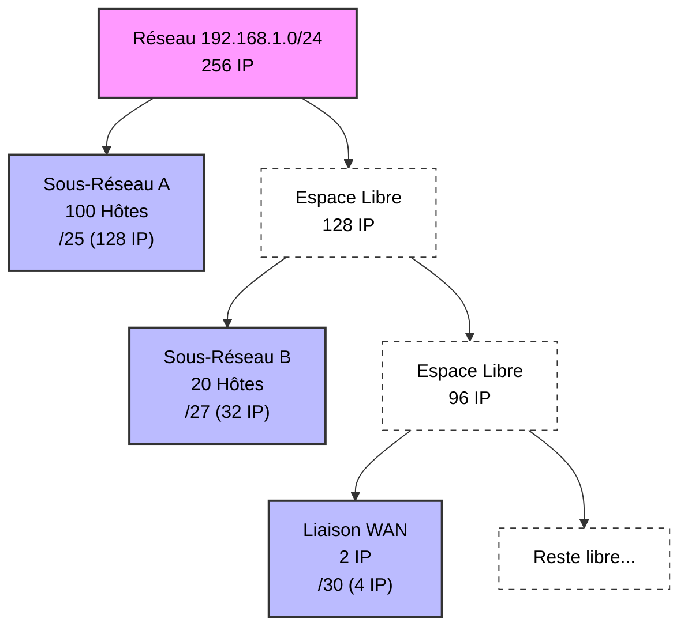

# 09 - Adressage IPv4 & Subnetting 🧮

> **Rôle :** Comprendre comment les adresses IP sont structurées, comment économiser des adresses avec le découpage (Subnetting) et comment concevoir un plan d'adressage efficace (VLSM).

---

## 1. La Structure d'une adresse IPv4 🧱

Une adresse IPv4 fait **32 bits**, divisés en 4 octets (x.x.x.x).
Elle est composée de deux parties, définies par le **Masque de sous-réseau**.

* **Partie Réseau (Network) :** L'identifiant de la rue. (Fixe pour tous les hôtes du même LAN).
* **Partie Hôte (Host) :** Le numéro de la maison. (Unique pour chaque machine).

### La Logique ET (AND)
Pour savoir dans quel réseau se trouve une IP, le routeur fait une opération mathématique binaire entre l'IP et le Masque.
* `1 ET 1 = 1`
* `1 ET 0 = 0` (Dès qu'il y a un 0, le résultat est 0).

> **En résumé :** Le masque agit comme un filtre. Il "laisse passer" la partie réseau et "met à zéro" la partie hôte.

---

## 2. Types d'Adresses (Cast & Portée) 📢

### Les 3 modes de communication

| Type | Description | Exemple |
| :--- | :--- | :--- |
| **Unicast** (Monodiffusion) | **1 vers 1**. Communication privée. | Naviguer sur le web, SSH. |
| **Broadcast** (Diffusion) | **1 vers Tous**. Tout le monde sur le LAN reçoit. | DHCP Discover, ARP Request. |
| **Multicast** (Multidiffusion) | **1 vers un Groupe**. Abonnement spécifique. | TV par IP, Protocoles de routage (OSPF). |

### Publique vs Privée (RFC 1918) 🔒
Toutes les IP ne vont pas sur Internet. Pour économiser les adresses, on utilise des adresses privées chez soi (LAN), qui sont traduites en publique par le NAT (Box/Routeur).

| Classe | Plage d'adresses Privées | Masque par défaut | Usage |
| :--- | :--- | :--- | :--- |
| **A** | `10.0.0.0` à `10.255.255.255` | /8 (`255.0.0.0`) | Très grands réseaux (Entreprises). |
| **B** | `172.16.0.0` à `172.31.255.255` | /12 (`255.240.0.0`) | Réseaux moyens (Campus). |
| **C** | `192.168.0.0` à `192.168.255.255` | /16 (`255.255.0.0`) | Petits réseaux (Maison, TPE). |

### Adresses Spéciales
* **Loopback (Boucle locale) :** `127.0.0.0/8` (souvent `127.0.0.1`). Pour tester sa propre carte réseau (Ping localhost).
* **Link-Local (APIPA) :** `169.254.x.x`. Attribuée automatiquement par Windows si le serveur DHCP ne répond pas.

---

## 3. Le Subnetting (Découpage en sous-réseaux) 🔪

**Pourquoi segmenter ?** Pour réduire le domaine de diffusion (moins de broadcast = réseau plus rapide) et pour la sécurité.

### La théorie des Bits
On "emprunte" des bits à la partie Hôte pour les donner à la partie Réseau.
* Plus on emprunte de bits -> Plus on a de sous-réseaux.
* Plus on emprunte de bits -> Moins on a d'hôtes par sous-réseau.

### Les Formules Magiques ✨

1.  **Nombre de sous-réseaux créés :** $2^n$ (où $n$ = bits empruntés).
2.  **Nombre d'hôtes utilisables :** $2^h - 2$ (où $h$ = bits restants pour l'hôte).
    * *Pourquoi -2 ?* On enlève l'adresse **Réseau** (la première) et l'adresse de **Broadcast** (la dernière).

### Tableau de référence CIDR (À connaître par cœur !)

| CIDR | Masque | Bits Hôtes | Hôtes Totaux | **Hôtes Utilisables** |
| :---: | :---: | :---: | :---: | :---: |
| **/24** | .0 | 8 | 256 | **254** |
| **/25** | .128 | 7 | 128 | **126** |
| **/26** | .192 | 6 | 64 | **62** |
| **/27** | .224 | 5 | 32 | **30** |
| **/28** | .240 | 4 | 16 | **14** |
| **/29** | .248 | 3 | 8 | **6** |
| **/30** | .252 | 2 | 4 | **2** (Liaison Routeur-Routeur) |
| **/31** | .254 | 1 | 2 | 2 (Cas spécial PtP) |
| **/32** | .255 | 0 | 1 | 1 (Adresse unique) |

---

## 4. La Méthode du "Nombre Magique" 🚀

Comment découper sans faire de binaire à chaque fois ?

**Exemple :** On a `192.168.1.0/24`. On veut des sous-réseaux de 50 hôtes.
1.  **Trouver la puissance de 2 :** Il faut $2^h > 50$. $2^6 = 64$. Donc il faut 6 bits hôtes.
2.  **Trouver le nouveau masque :** $32 - 6 = 26$. Le nouveau masque est **/26**.
3.  **Trouver le Nombre Magique (Le Pas) :**
    * Masque /26 = `255.255.255.192`
    * Le Nombre Magique = **256 - (Dernier octet non nul du masque)**
    * $256 - 192 = \mathbf{64}$.
    * **Le réseau avance de 64 en 64.**

**Résultat :**
* **Sous-réseau 1 :** 192.168.1.**0** (Plage : .1 à .62) | Broadcast : .63
* **Sous-réseau 2 :** 192.168.1.**64** (Plage : .65 à .126) | Broadcast : .127
* **Sous-réseau 3 :** 192.168.1.**128** ...

---

## 5. VLSM (Variable Length Subnet Mask) 📐

Le subnetting classique coupe le gâteau en parts égales. Le VLSM coupe des parts de tailles différentes selon les besoins (Gaspillage minimal).

**La Règle d'Or :** Toujours commencer par le sous-réseau qui a besoin du **PLUS** d'adresses.

**Scénario :**
* Bâtiment A : 100 hôtes
* Bâtiment B : 20 hôtes
* Liaison WAN : 2 IP

**Processus :**
1.  On prend le réseau global.
2.  On coupe une part pour les **100 hôtes** (/25).
3.  Il reste de la place ? Oui.
4.  Dans ce qui reste, on coupe une part pour les **20 hôtes** (/27).
5.  Dans ce qui reste, on coupe une part pour le **WAN** (/30).

---

## 6. Bonnes Pratiques de Conception 🏗️

Pour ne pas se perdre dans ses IP :

1. **Périphériques finaux (PC, Imprimantes) :** DHCP (Automatique). Sauf imprimantes/serveurs qui doivent être en Statique.
2. **Passerelle (Routeur) :** Par convention, souvent la **première** (.1) ou la **dernière** (.254) adresse utilisable du sous-réseau.
3. **Documentation :** Toujours documenter le plan d'adressage (VLAN 10 = 192.168.10.0/24 = RH).
