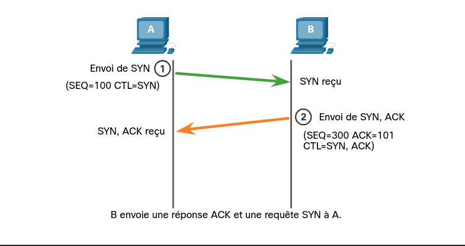

# 11 - La Couche Transport (Layer 4) 🚂

> **Rôle :** Assurer la communication de bout en bout entre les applications. Elle segmente les données reçues de la couche application et les prépare pour le transport sur le réseau.

---

## 1. Rôle et Responsabilités 📋

La couche transport ne s'occupe pas de la route (c'est l'IP), elle s'occupe de la **qualité** et de la **destination applicative**.

* **Segmentation :** Découpe les gros fichiers en morceaux gérables (segments).
* **Reconstitution :** Remet les morceaux dans l'ordre à l'arrivée.
* **Identification :** Utilise les **numéros de port** pour envoyer les données à la bonne application (ex: Navigateur vs Spotify).
* **Multiplexage :** Permet à plusieurs applications d'utiliser le réseau en même temps.

---

## 2. TCP vs UDP : Le grand duel ⚔️

| Caractéristique | **TCP** (Transmission Control Protocol) | **UDP** (User Datagram Protocol) |
| --- | --- | --- |
| **Fiabilité** | ✅ Garantie (Accusés de réception) | ❌ Non garantie (Best effort) |
| **Mode** | Connecté (Établit une session) | Sans connexion |
| **Ordre** | Reconstruit les données dans l'ordre | Laisse les données dans l'ordre d'arrivée |
| **Vitesse** | Plus lent (surcharge d'en-tête) | Très rapide (faible surcharge) |
| **Usage** | Web, Email, Transfert de fichiers (FTP) | Streaming, VoIP, Jeux en ligne, DNS |

---

## 3. Les Numéros de Port 🔑

C'est "l'adresse" de l'application à l'intérieur de la machine.

* **Socket :** C'est la combinaison `IP : Port` (ex: `192.168.1.1:80`). Elle identifie une connexion unique.

### Les plages de ports

* **0 - 1023 (Well-known) :** Services standards (HTTP: 80, HTTPS: 443, SSH: 22, DNS: 53).
* **1024 - 49151 (Registered) :** Applications spécifiques (ex: MySQL: 3306).
* **49152 - 65535 (Private/Dynamic) :** Ports temporaires utilisés par votre PC pour initier une connexion.

> **Outil de vérification :** Tapez `netstat -n` dans votre terminal pour voir vos connexions actives et les ports utilisés.

---

## 4. Le Protocole TCP : La Fiabilité Absolue 🛡️

### A. L'en-tête TCP (20 octets)

Il contient les numéros de **Séquence** et d'**Accusé de réception** (ACK) qui permettent de garantir que rien ne manque.

### B. Établissement de connexion (3-Way Handshake)

Avant d'envoyer la moindre donnée, TCP vérifie que le destinataire est prêt.

1. **SYN :** "Bonjour, on se parle ?" (Synchronize)

  

---

2. **SYN-ACK :** "Oui, je suis prêt !"

  

---

3. **ACK :** "Super, j'envoie les données." (Acknowledgment)

  

### C. Fermeture de session (4-Way Handshake)

Pour finir proprement : **FIN** → **ACK** → **FIN** → **ACK**.

---

## 5. Fiabilité et Contrôle de Flux (Le génie de TCP) 🧠

C'est ici que TCP gère les problèmes sans que l'utilisateur ne s'en aperçoive.

* **Numéros de Séquence :** Permettent de remettre les segments dans le bon ordre si le réseau les a mélangés.
* **Accusés de réception (ACK) :** Si l'émetteur ne reçoit pas d'ACK pour un segment, il le **retransmet** automatiquement.
* **Taille de la fenêtre (Window Size) :** C'est le nombre d'octets que l'émetteur peut envoyer avant d'attendre un ACK.
* *Contrôle de flux :* Si le destinataire est débordé, il demande une fenêtre plus petite pour ralentir le débit.

* **MSS (Maximum Segment Size) :** La taille maximale de données que le segment peut contenir.

---

## 6. Le Protocole UDP : La Vitesse Pure 🚀

UDP est simple. Il n'y a pas de poignée de main, pas d'ordre, pas de vérification. Si un segment est perdu, il est perdu.

### L'en-tête UDP (8 octets seulement !)

Il ne contient que 4 champs : Port source, Port destination, Longueur et Checksum.

### Pourquoi l'utiliser ?

* **Faible latence :** Vital pour la voix ou la vidéo où un petit "glitch" vaut mieux qu'une pause de 2 secondes pour attendre une retransmission.
* **Transactions rapides :** Comme le DNS (une requête, une réponse).

---

## 💡 Résumé pour le Dépannage

* **Si l'application est lente :** Regardez du côté de TCP (Taille de fenêtre ou retransmissions dues à des pertes de paquets).
* **Si la voix est hachée :** C'est UDP qui subit des pertes sur le réseau (pas de retransmission possible).
* **Bloqué par un Firewall ?** Vérifiez si c'est le **Port** qui est fermé (Couche 4) ou l'**IP** (Couche 3).
